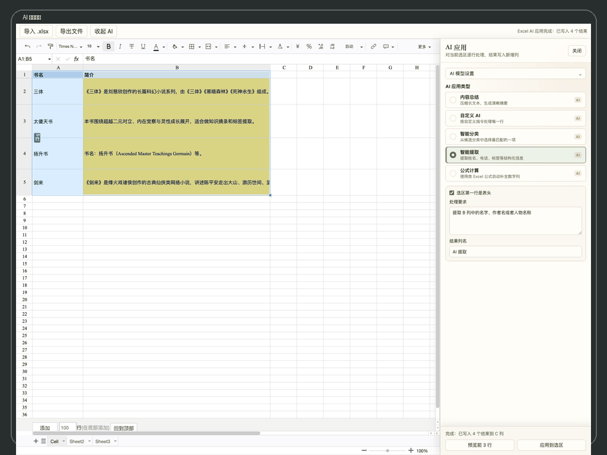

# Excel AI 编辑器

在思源笔记当前页面中插入可编辑的 Excel 表格，并用 AI 对选中区域逐行处理。它适合把阅读摘录、课程清单、资料表、客户表、选题表放进笔记里，继续做整理、提取、分类和公式计算。

需要完整教程可以阅读：[中文使用说明](MANUAL_zh_CN.md)。


## 界面预览



## 你可以用它做什么

- 在当前笔记页面直接插入 Excel 表格，不跳转到独立页面。
- 导入 `.xlsx` 文件，编辑后再导出为 `.xlsx`。
- 点击 `保存` 后，当前表格数据会写入思源数据目录并覆盖保存；关闭或重启思源后再次打开会自动恢复。
- 保存后可恢复公式、边框、单元格样式、对齐方式、行高列宽和常见 Luckysheet 工作簿配置。
- 使用常见表格能力：单元格编辑、格式、边框、工作表切换、行列选择。
- 对选区运行 AI：总结、改写、分类、提取、公式计算。
- 先预览前 3 行，再应用到整个选区。
- AI 结果默认写入新增列，不覆盖原始数据。

## AI 应用

- 内容总结：把长文本压缩成清晰摘要。
- 自定义 AI：按你的指令逐行处理表格内容。
- 智能分类：从候选分类里选择最匹配的一项。
- 智能提取：提取姓名、电话、标签、书名、作者等结构化信息。
- 公式计算：支持类 Excel 公式，也可以用自然语言让 AI 补全公式。

## 模型支持

默认连接本机 Ollama，也支持以下模型服务：

- 本地模型：Ollama、LM Studio。
- 主流 API：OpenAI、DeepSeek、Kimi、智谱 GLM、阿里云百炼 / 通义千问、Google Gemini、Anthropic Claude。
- 聚合与自定义：硅基流动、OpenRouter、自定义 OpenAI-compatible 接口。

本地地址 `localhost`、`127.0.0.1`、`::1` 会直接请求；远程 API 会通过思源 `/api/network/forwardProxy` 转发，避免浏览器跨域限制。

## 使用方法

1. 启用插件后，点击思源顶部栏的表格图标。
2. 插件会在当前笔记页面插入一个 Excel AI 表格块。
3. 直接编辑默认表格，或点击 `导入 .xlsx` 导入工作簿。
4. 在表格中选择需要处理的区域。
5. 点击 `AI 应用`，选择应用类型并确认模型设置。
6. 点击 `预览前 3 行` 检查效果。
7. 点击 `应用到选区`，结果会写入新增结果列。
8. 修改完成后点击顶部栏 `保存`，下次打开当前笔记会自动恢复最新保存的数据。

## 公式示例

```text
={单价}*{数量}
ROUND(AVG({语文},{数学}), 1)
SUM({收入},-{支出})
```

支持 `SUM`、`AVG`、`MIN`、`MAX`、`ROUND`、`ABS`、`COUNT`、`POW`、`SQRT`。

## 隐私说明

- 使用本地模型时，选区内容只会发送到你填写的本地服务地址。
- 使用第三方云端 API 时，当前选区内容会发送到对应服务商。
- API Key 仅保存在当前思源客户端的插件数据中。
- 插件不会主动上传整篇笔记，只处理你在表格里选中的区域。

## 手动安装

从 GitHub Release 下载 `package.zip`，解压后将插件目录放入：

```text
SiYuan/data/plugins/siyuan-excel-ai
```

重启思源后，在集市的已下载插件中启用。

## 当前限制

- 当前版本只保证 `.xlsx` 导入导出。
- 插件内点击 `保存` 会保存公式、边框、常见单元格样式、对齐方式、行高列宽和常见 Luckysheet 配置；`.xlsx` 导入导出仍优先保证内容，宏和复杂高级对象暂不作为兼容重点。
- AI 写回默认新增结果列，不提供覆盖原选区模式。
- 表格编辑器运行在当前笔记的 iframe 中，移动端暂未作为第一版重点适配。

## 支持与打赏

如果这个插件帮你节省了时间，可以请月亮喝杯茶。你的喜欢和赞赏，是我继续维护的动力。


## 第三方来源

本插件复刻并扩展了 [muhanstudio/siyuan-excel](https://github.com/muhanstudio/siyuan-excel) 的 Excel 编辑器形态，表格编辑器基于 Luckysheet，`.xlsx` 读写使用 SheetJS。

## 许可证

[MIT](LICENSE)
